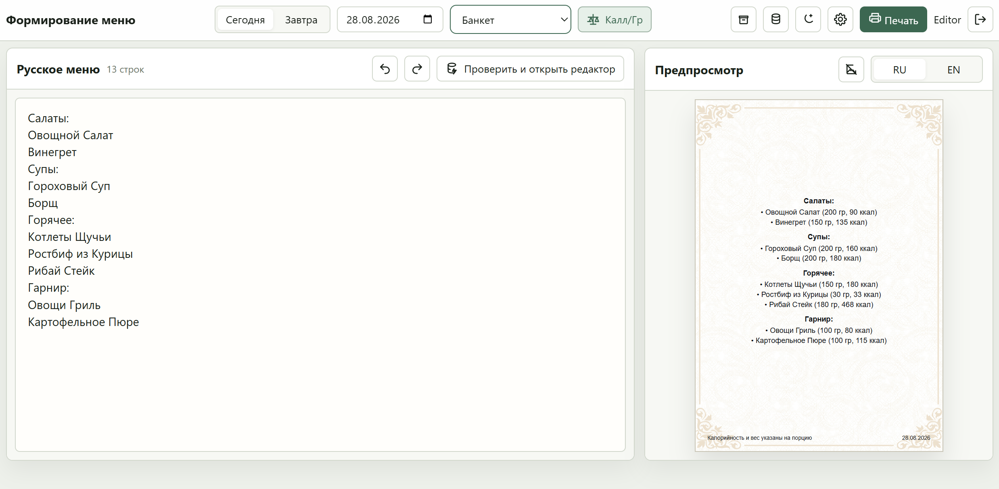
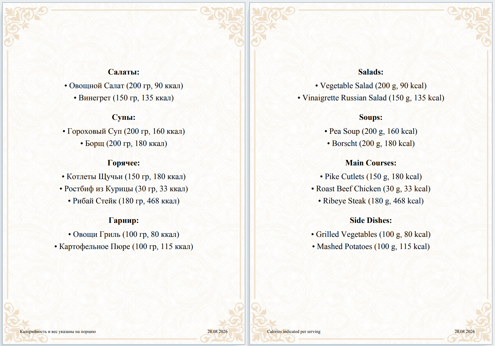

# Menu AutoPrint

Репозиторий: `https://github.com/dz0l/Menu-AutoPrint`

Инструкция по установке: [INSTALL.MD](INSTALL.MD)
English version: [INSTALL.EN.MD](INSTALL.EN.MD)

Инструкция пользователя: 
(RU GUIDE) [GUIDE.MD](GUIDE.MD)

### Краткое описание

**Menu AutoPrint** - веб-приложение для быстрого формирования, перевода и печати меню. Пользователь вводит меню на русском языке, а система автоматически формирует английскую версию, подставляет калорийность и граммовку блюд, показывает предварительный результат и позволяет получить готовый PDF для печати.

Программа поддерживает работу с несколькими локациями и типами меню, фоновыми подложками, архивом готовых документов и базой блюд.

### Основные возможности

* 📝 **Быстрое создание меню** - ввод блюд обычным текстом, по одной позиции на строку.
* 🌐 **Автоматический перевод** - формирование английской версии меню на основе базы блюд.
* 🍽️ **Автозаполнение данных** - автоматическая подстановка калорийности и граммовки.
* 💡 **Подсказки при вводе** - поиск подходящих блюд непосредственно во время набора.
* 👀 **Предпросмотр перед печатью** - визуальная проверка готового меню на листе.
* 📄 **Генерация PDF** - автоматическое формирование файла, подготовленного для печати.
* 🎨 **Подложки** - использование фирменных фоновых изображений для разных локаций.
* 📚 **Архив** - хранение ранее созданных PDF с возможностью просмотра и скачивания.
* 🗂️ **База блюд** - единая база русских и английских названий, калорийности, граммовок и групп.
* 📊 **Экспорт CSV** - выгрузка базы блюд для дальнейшей работы.
* 📱 **Веб-интерфейс** - работа через браузер без необходимости устанавливать программу на компьютер.

### Для администратора

Menu AutoPrint также предоставляет инструменты для управления системой:

* редактирование и пополнение базы блюд;
* контроль отсутствующих переводов и данных;
* управление пользователями;
* создание и сброс паролей;
* загрузка и управление подложками для разных локаций;
* настройка автоматического форматирования;
* ведение логирования;

### Как это работает

Работа с программой занимает несколько шагов:

**Ввести меню -> проверить предпросмотр -> выбрать дату и подложку -> нажать «Печать» -> получить готовый PDF.**

При этом пользователю не нужно самостоятельно форматировать документ, переводить названия блюд или рассчитывать их параметры - необходимые данные система берет из базы.

## **Скриншоты интерфейса**

Главный экран:

Результат в PDF на 2х страницах:
